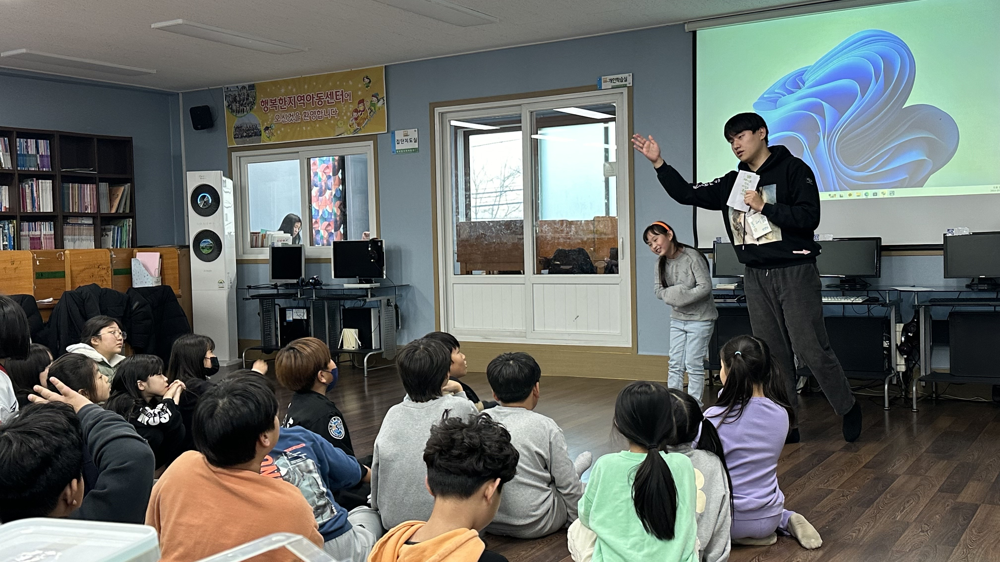
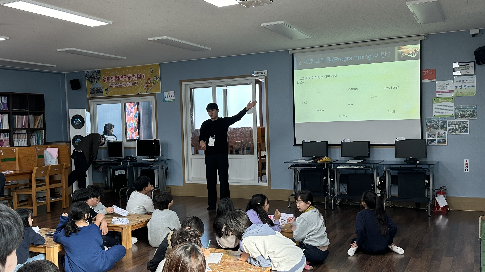

# 🎓 Coding Education Volunteer

> **"메모장에서 시작된 나의 개발 여정"**  
> 초등학생 코딩 교육 봉사활동을 통해 개발자로서의 첫 걸음을 내딛다

<div align="center">
  
</div>

---

## 🎯 프로젝트 개요

**HTML과 JavaScript만으로 만든 인터랙티브 게임**을 통해 아이들에게 코딩의 개념을 가르친 교육 봉사 프로젝트입니다.

### 🎮 [게임 플레이하기](https://honghyechang.github.io/Coding-Education-Volunteer/)

클릭 시 게임 플레이!

### 🎥 시연 영상
[](https://youtu.be/HKWUzKDn9Eo)
> 🔗 **[전체 시연 영상 보기](https://youtu.be/HKWUzKDn9Eo)** - 실제 게임 플레이 과정 확인


---

## 📌 활동 정보

| 항목 | 내용 |
|------|------|
| **프로그램명** | 2023학년도 동계 [제28기] 대학생 재능봉사 캠프 |
| **활동 기간** | 2024년 1월 29일 ~ 2월 2일 (5일간, 총 30시간) |
| **활동 장소** | 행복한지역아동센터 (강원도 동해) |
| **대상** | 초등학생 30명, 중·고등학생 5명 |
| **팀 구성** | 대학생 봉사자 8명 |
| **담당 역할** | HTML/JavaScript 게임 개발, 교육 자료 제작, 수업 진행 |

---

## 💡 프로젝트 배경

### "배포도 모르던 3학년, HTML로 시작한 도전"

당시 저는:
- ✅ HTML/JavaScript 기초만 배운 3학년 1학기
- ❌ Git, 배포, 서버 사용 경험 없음

**그래서 선택한 방법:**
1. 메모장에 HTML 코드 작성
2. 이메일로 코드 파일 전송
3. 봉사 현장에서 수동으로 이미지 교체
4. 학생들 그림으로 실시간 게임 진행

**미숙했지만, 아이들에게는 마법 같은 경험이었습니다.**

---

## 🎨 게임 소개: 틀린그림찾기

### 게임 특징

- 🖼️ **학생 참여형**: 아이들이 직접 그린 그림이 게임으로!
- 🎵 **배경음악**: 랜덤 동요 13곡 (아이들이 따라 부르며 진행)
- ⏱️ **타이머**: 30초 제한시간의 긴장감
- ❤️ **목숨 시스템**: 5번의 기회
- ✨ **실시간 피드백**: O/X 표시 및 애니메이션

### 게임 진행 방식
```
1. 학생들이 5~6명씩 조를 이루어 "before" 그림 그리기
2. 선생님(봉사자)이 사진 촬영
3. 같은 그림에 요소 추가하여 "after" 그림 완성
4. 코드에 틀린 부분 좌표 설정
5. 다른 조가 게임으로 틀린 부분 찾기!
```

<div align="center">
  
  
</div>

---

## 📚 교육 내용

**[📊 전체 수업 자료 보기](./docs/presentation.pdf)**

#### 커리큘럼 구성

1. **코딩(Coding)이란?**
   - 컴퓨터에게 명령하는 언어
   - 피카츄 예시로 쉽게 설명

2. **프로그래밍(Programming)이란?**
   - 코딩 vs 프로그래밍의 차이
   - 다양한 프로그래밍 언어 소개

3. **코딩을 왜 배울까?**
   - 논리적 사고력 향상
   - 문제 해결 능력
   - 4차 산업혁명 시대 대비

4. **실습: 틀린그림찾기 게임**
   - 직접 그림 그리기
   - 게임 진행 및 체험

---

## 🛠️ 기술 스택

### 사용 기술
```
Frontend: HTML5, CSS3, Vanilla JavaScript
Game Engine: HTML Canvas API
Audio: Web Audio API
Deployment: 수동 배포 (메모장 → 이메일 → 로컬 실행)
```

### 주요 기능 구현

- **Canvas 기반 드로잉**: 실시간 O/X 표시 및 애니메이션
- **좌표 기반 충돌 감지**: 클릭한 위치와 정답 영역 비교
- **타이머 시스템**: setInterval을 활용한 카운트다운
- **라이프 시스템**: 오답 횟수에 따른 하트 감소
- **랜덤 배경음악**: 13가지 동요 중 랜덤 재생

---

## 💪 기술적 도전과 극복

### 1. 배포 문제
**문제**: Git, 서버, 호스팅 경험 없음
**해결**: 메모장으로 코드 작성 → 이메일 전송 → 현장에서 수동 설정

### 2. 실시간 이미지 교체
**문제**: 학생들이 그린 그림을 즉시 게임에 반영해야 함  
**해결**: 파일 경로만 수정하면 되도록 단순한 구조 설계

### 3. 초등학생 눈높이 맞추기
**문제**: 복잡한 코딩 개념 전달의 어려움  
**해결**: 피카츄, 게임 등 친숙한 비유 활용

---

## 🎉 성과 및 반응

### 학생들의 반응

> *"선생님! 제가 그린 그림이 진짜 게임이 됐어요!"*  
> *"평소에 폰으로 하던 틀린그림찾기를 우리가 만들 수 있다니!"*  
> *"코딩으로 이런 것도 만들 수 있어요?"*

**가장 기억에 남는 순간:**  
한 학생이 평소 폰으로 즐기던 틀린그림찾기 게임을 직접 그린 그림으로 친구들과 함께 즐기면서, **"나도 개발자가 될 수 있을 것 같아요!"** 라고 말했던 순간.

게임 배경음악(동요)이 나올 때마다 아이들이 게임 중에도 노래를 따라 부르는 모습을 보며, **사용자 경험을 고려한 개발**의 중요성을 깨달았습니다.

---

## 🌱 개발자로서의 성장

### Before (봉사 활동 전)
```
❌ 배포 개념 전혀 모름
❌ Git, GitHub 사용 경험 없음
❌ 코드를 실제 사용자에게 제공해본 적 없음
❌ 사용자 경험(UX) 고려 안 함
```

### After (봉사 활동 후)
```
✅ 배포의 중요성 깨달음
✅ 사용자 관점에서 생각하기 시작
✅ 단순한 코드도 가치를 만들 수 있다는 확신
✅ 기술로 누군가를 돕는 기쁨 경험
✅ 더 나은 개발자가 되고 싶다는 동기 부여
```

---

## 💭 회고

### "부끄럽지만 소중했던 시작"

돌이켜 보면 매우 원시적이고 비효율적인 방법이었습니다.  
메모장으로 코딩하고, 이메일로 전송하고, 수동으로 이미지를 교체하는...

하지만 이 경험은 저에게 **개발자로서의 정체성**을 심어준 첫 순간이었습니다.

- 📝 **코드로 문제를 해결**할 수 있다는 것
- 👥 **사용자 중심으로 생각**해야 한다는 것  
- 🚀 **기술로 누군가를 행복**하게 할 수 있다는 것
- 💡 **미숙해도 도전**할 수 있다는 것

이 봉사활동이 없었다면, 지금의 저는 없었을 것입니다.

---
